# LESforMacOS Custom — アーキテクチャドキュメント

> 開発者向けの内部設計ドキュメントです。
> GUI の仕組み、モジュール構成、データフローを解説します。

## 目次

- [GUI アーキテクチャ](#gui-アーキテクチャ)
- [3層 UI 構造](#3層-ui-構造)
- [ネイティブ UI 層（Objective-C + XIB）](#ネイティブ-ui-層objective-c--xib)
- [Hammerspoon Lua API 層](#hammerspoon-lua-api-層)
- [イベント駆動層（hs.eventtap）](#イベント駆動層hseventtap)
- [モジュール構成とデータフロー](#モジュール構成とデータフロー)
- [起動シーケンス](#起動シーケンス)
- [プラグインメニュー構築フロー](#プラグインメニュー構築フロー)
- [キーストローク処理パイプライン](#キーストローク処理パイプライン)
- [アプリケーション監視](#アプリケーション監視)
- [パフォーマンス設計](#パフォーマンス設計)

---

## GUI アーキテクチャ

LES の GUI は独自のウィンドウを描画せず、macOS 標準の UI コンポーネントを Lua スクリプトから呼び出す構成です。

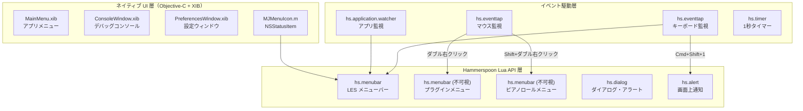

---

## 3層 UI 構造

### 各層の役割

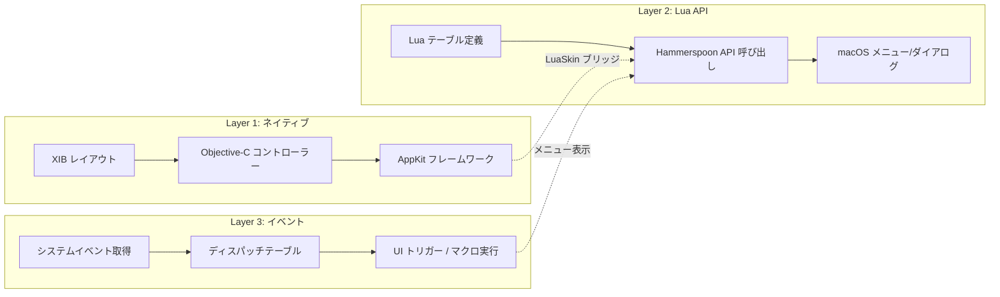

| 層 | 技術 | 用途 | 変更頻度 |
|----|------|------|---------|
| ネイティブ UI | Objective-C + XIB | コンソール、設定、アプリメニュー | ほぼ変更なし |
| Lua API | Hammerspoon Lua API | LES メニュー、ダイアログ、通知 | 機能追加時 |
| イベント駆動 | hs.eventtap / hs.timer | キー監視、マウス監視、タイマー | ショートカット追加時 |

---

## ネイティブ UI 層（Objective-C + XIB）

Hammerspoon コアが提供する GUI で、LES からは直接変更しません。

### ファイル構成

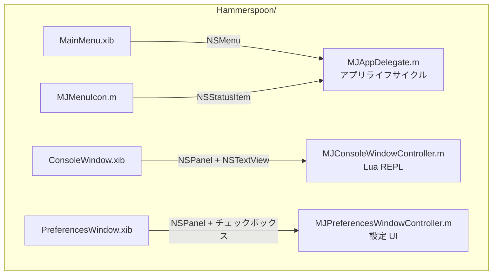

### 主要コンポーネント

| ファイル | クラス | UI 要素 |
|---------|--------|---------|
| `MainMenu.xib` | — | アプリケーションメニュー（About, Preferences, Edit, Help） |
| `ConsoleWindow.xib` | `MJConsoleWindowController` | Lua 実行コンソール（入力欄 + 出力ビュー） |
| `PreferencesWindow.xib` | `MJPreferencesWindowController` | 設定パネル（起動時起動、Dock アイコン、コンソール常前面） |
| `MJMenuIcon.m` | `MJMenuIcon` | ステータスバーのアイコン（NSStatusItem） |
| `MJAppDelegate.m` | `MJAppDelegate` | アプリ起動・終了、URL スキーム、Dock クリック処理 |

### コンソールウィンドウの詳細

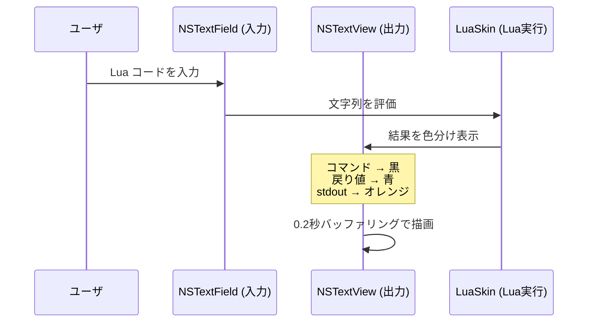

- 最大 100,000 行の履歴を保持
- 出力は 0.2 秒のバッファリングで描画パフォーマンスを確保
- ダーク/ライトモード対応（NSAppearance）

---

## Hammerspoon Lua API 層

LES のユーザ向け GUI の中心。全て Lua テーブルで定義し、Hammerspoon API でレンダリングします。

### メニューバーの構造

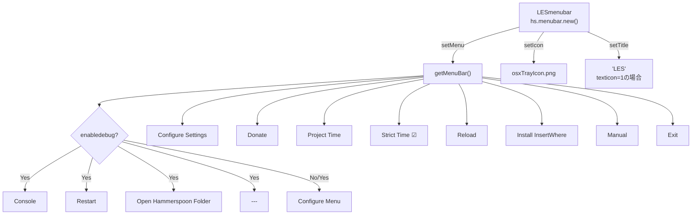

### 不可視メニューバーによるコンテキストメニュー

LES の最も特徴的な GUI パターンです。

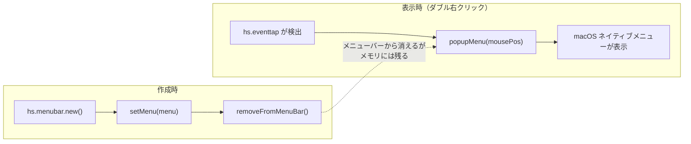

```lua
-- 作成（起動時に1回）
pluginMenu = hs.menubar.new()
pluginMenu:setMenu(menu)            -- Lua テーブルからメニュー生成
pluginMenu:removeFromMenuBar()      -- メニューバーから非表示

-- 表示（ダブル右クリック時）
pluginMenu:popupMenu(hs.mouse.absolutePosition())
```

**なぜこの方式か？**
- Hammerspoon にはネイティブのコンテキストメニュー API がない
- `hs.menubar` の `popupMenu()` を使えば任意の座標にメニューを表示できる
- macOS 標準のメニュー描画を利用するため、見た目が自然

### ダイアログとアラート

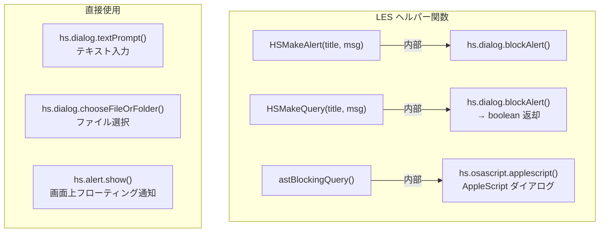

| 関数 | 用途 | ブロッキング |
|------|------|------------|
| `HSMakeAlert()` | 情報表示 | Yes |
| `HSMakeQuery()` | Yes/No 確認 → boolean | Yes |
| `astBlockingQuery()` | Live フォーカス中の確認 | Yes（AppleScript 経由） |
| `hs.dialog.textPrompt()` | テキスト入力（チートメニュー） | Yes |
| `hs.dialog.chooseFileOrFolder()` | フォルダ選択（InsertWhere） | Yes |
| `hs.alert.show()` | 画面上通知（一時停止通知など） | No（自動消去） |

---

## イベント駆動層（hs.eventtap）

全てのユーザ入力はイベントタップで捕捉し、ディスパッチテーブルで振り分けます。

### eventtap の全体像

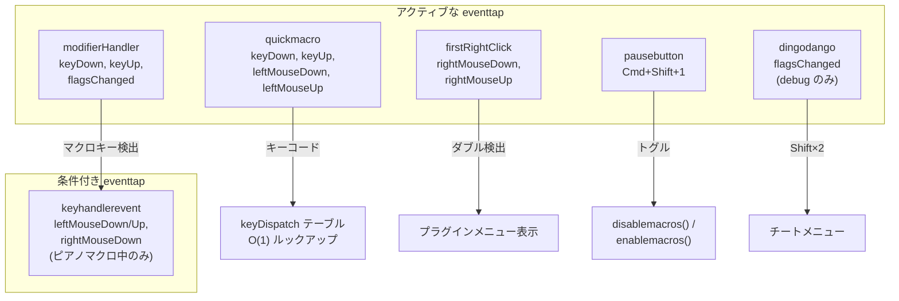

### eventtap のライフサイクル

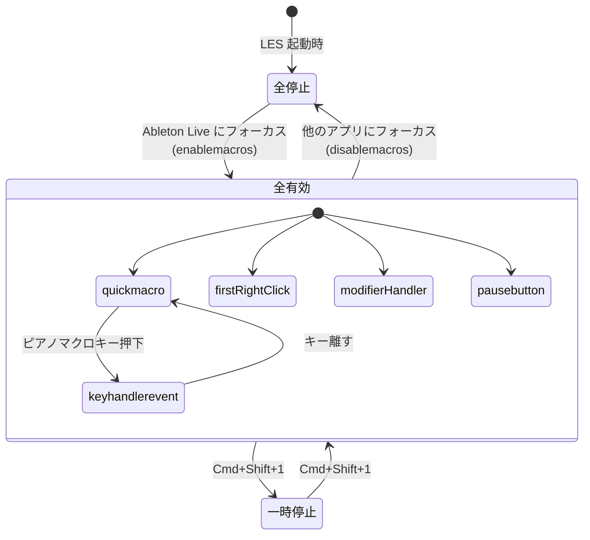

---

## モジュール構成とデータフロー

### モジュール依存関係

```mermaid
graph TD
    MAIN["LESmain.lua<br/>オーケストレーター"] --> MOD["module.lua<br/>バージョン検証"]
    MAIN --> HELP["helpers.lua<br/>ファイル操作"]
    MAIN --> PROC["proccom.lua<br/>Live 検出"]
    MAIN --> SET["settings.lua<br/>設定管理"]

    MAIN --> MB["menus/bar.lua<br/>メニューバー定義"]
    MAIN --> MK["menus/keys/menu.lua<br/>スケール/コード"]
    MAIN --> MP["menus/plugin.lua<br/>プラグインメニュー構築"]

    MAIN --> LR["lifecycle/reload.lua<br/>リロード処理"]
    MAIN --> LA["lifecycle/appwatch.lua<br/>アプリ監視"]

    MAIN --> SM["shortcuts/macros.lua<br/>キーマクロ"]
    MAIN --> SR["shortcuts/rightclick.lua<br/>右クリックメニュー"]
    MAIN --> SP["shortcuts/piano.lua<br/>ピアノマクロ"]
    MAIN --> VS["vst/shortcuts.lua<br/>VST ショートカット"]

    MAIN --> TT["tracking/timer.lua<br/>時間追跡"]

    MAIN --> GC["globals/constants.lua"]
    MAIN --> GF["globals/filepaths.lua"]
    MAIN --> US["util/string.lua"]
    MAIN --> UI["util/io.lua"]

    LR -->|reloadLES()| MP
    LR -->|reloadLES()| MB
    LA -->|enablemacros()| SM
    LA -->|enablemacros()| SR
    LA -->|enablemacros()| SP
    TT -->|VST検出| VS

    style MAIN fill:#e1f5fe
    style SM fill:#fff3e0
    style MP fill:#fff3e0
    style LA fill:#fff3e0
```

---

## 起動シーケンス

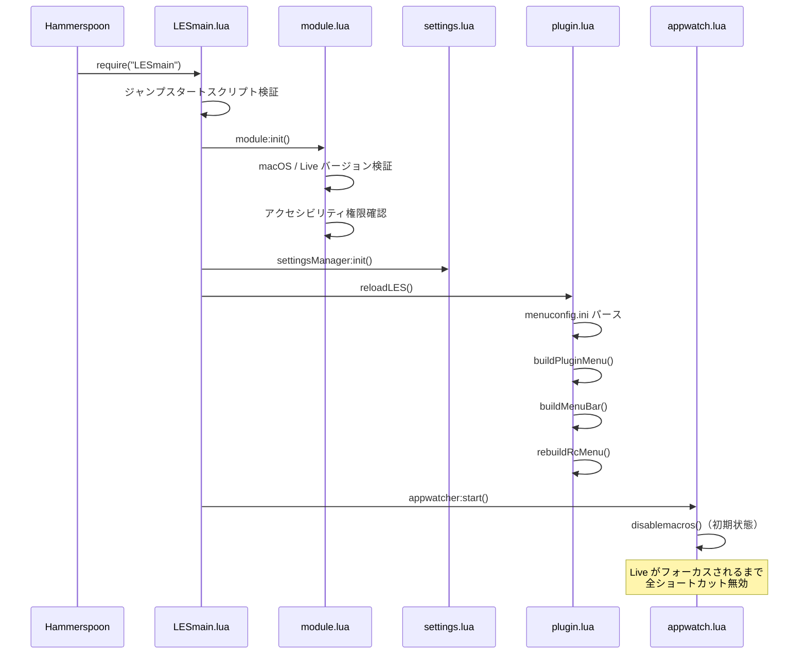

---

## プラグインメニュー構築フロー

1200件のプラグインを menuconfig.ini からパースしてメニューに変換する処理です。

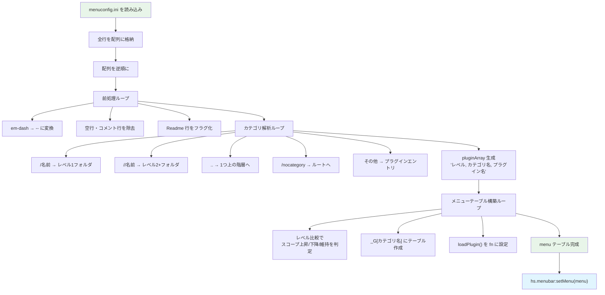

---

## キーストローク処理パイプライン

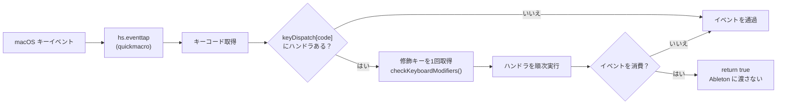

---

## アプリケーション監視

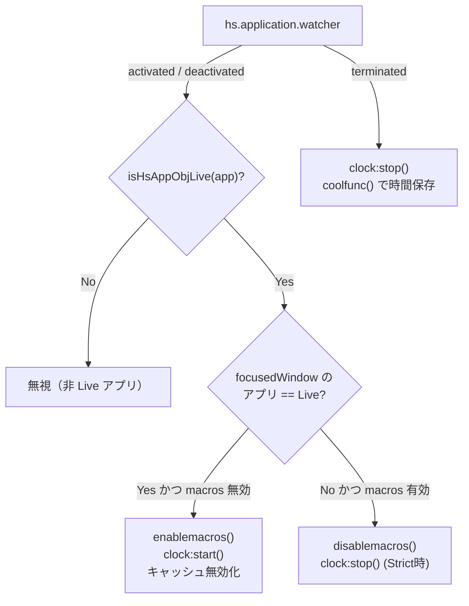

---

## パフォーマンス設計

### ホットパスと最適化

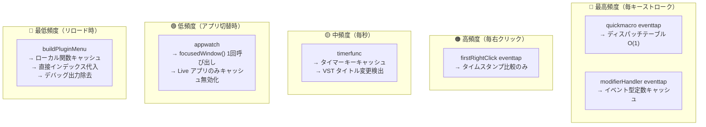

### キャッシュ戦略

| キャッシュ | TTL | 無効化タイミング | 対象 |
|-----------|-----|----------------|------|
| `getLiveHsAppObj()` | 2秒 | アプリフォーカス変更時 | `hs.application.find()` の結果 |
| `getTimerKey()` | 永続 | なし | `"timer_" .. name` の文字列連結 |
| `vstWindowState` | 永続 | タイトル変更時 | VST ウィンドウのタイトル |
| `keyhandlerevent` | 永続 | なし | ピアノマクロ用 eventtap インスタンス |
| `gValidTitleTable` | セッション | `enablemacros()` 時に再構築 | Live メニュー項目テーブル |
